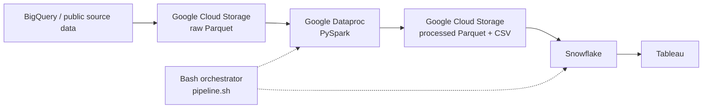

# Chicago Taxi Demand Pipeline

## Project Overview

This MGMT 405 course project integrates 2017 Chicago taxi trip activity with
2017 ACS five-year census-tract characteristics. The reproducible pipeline
creates a monthly pickup-demand dataset at the tract level for analysis in
Snowflake and Tableau.

## Group Project

This urban mobility project was developed collaboratively by me and my five
teammates. This repository is my portfolio copy of our team project, with the
shared project history preserved. It includes our data pipeline and Tableau
dashboard workbook, with the workbook located under `tableau/`.

## Pipeline Architecture



The Bash entry point uploads and submits the Spark job, waits for Dataproc,
finds the resulting one-part CSV, loads that file through an existing Snowflake
external stage, and runs validation queries.

## Data Sources

- **Chicago Taxi Trips 2017:** trip records from the Chicago Taxi Trips public
  data available in BigQuery, filtered to calendar year 2017.
- **ACS census tract 2017 five-year estimates:** tract-level demographic and
  socioeconomic measures from the Census Bureau ACS public data in BigQuery.

Public table locations and export templates are documented in
[Data setup](docs/data_setup.md). Confirm that the public tables remain
available in your BigQuery environment before running the one-time setup.

## Repository Structure

```text
chicago-taxi-demand-pipeline/
├── README.md
├── pipeline.sh
├── requirements.txt
├── .gitignore
├── dataproc/
│   ├── README.md
│   └── clean_and_aggregate_v3.py
├── snowflake/
│   ├── README.md
│   └── load_final_dataset.sql
├── docs/
│   ├── data_setup.md
│   ├── pipeline_setup.md
│   └── snowflake_setup.md
├── tableau/
│   ├── README.md
│   └── MSBA405_Final_Project_Dashboard.twb
├── tests/
│   └── smoke_test.py
└── archive/
    ├── README.md
    └── dele
```

## One-Time Setup

1. Prepare the two raw Parquet datasets in GCS as described in
   [docs/data_setup.md](docs/data_setup.md).
2. Create and start a Dataproc cluster that can read and write the bucket.
3. Install and authenticate the Google Cloud CLI and Snowflake CLI.
4. Create a Snowflake storage integration and external stage rooted at the
   bucket's `processed/` folder, as described in
   [docs/snowflake_setup.md](docs/snowflake_setup.md).
5. Review complete execution prerequisites in
   [docs/pipeline_setup.md](docs/pipeline_setup.md).

PySpark is supplied by Dataproc. `requirements.txt` records the Python runtime
dependency for local development; the offline smoke tests use only the Python
standard library.

## Environment Variables

Export configuration in the shell that will run the pipeline:

```bash
export GCP_PROJECT_ID='YOUR_GCP_PROJECT_ID'
export GCS_BUCKET='YOUR_GCS_BUCKET_NAME'
export DATAPROC_CLUSTER='YOUR_DATAPROC_CLUSTER_NAME'
export DATAPROC_REGION='YOUR_DATAPROC_REGION'
export PYSPARK_FILE='dataproc/clean_and_aggregate_v3.py'

export SNOWFLAKE_ACCOUNT='YOUR_SNOWFLAKE_ACCOUNT'
export SNOWFLAKE_USER='YOUR_SNOWFLAKE_USERNAME'
export SNOWFLAKE_PASSWORD='YOUR_SNOWFLAKE_PASSWORD'
export SNOWFLAKE_ROLE='YOUR_SNOWFLAKE_ROLE'
export SNOWFLAKE_WAREHOUSE='YOUR_SNOWFLAKE_WAREHOUSE'
export SNOWFLAKE_DATABASE='YOUR_SNOWFLAKE_DATABASE'
export SNOWFLAKE_SCHEMA='YOUR_SNOWFLAKE_SCHEMA'
export SNOWFLAKE_TABLE='YOUR_SNOWFLAKE_TABLE'
export SNOWFLAKE_FILE_FORMAT='YOUR_SNOWFLAKE_FILE_FORMAT'
export SNOWFLAKE_STAGE='YOUR_SNOWFLAKE_STAGE'
```

Never commit credentials or an environment file. The password remains in the
process environment and is not echoed, written into SQL, or saved as a named
Snowflake CLI connection by this project.

## How to Run

After exporting the variables:

```bash
chmod +x pipeline.sh
./pipeline.sh
```

No additional input is required. The script stops on the first failed check or
cloud command.

## Outputs

With `GCS_BUCKET=YOUR_GCS_BUCKET_NAME`, the job overwrites:

- `gs://YOUR_GCS_BUCKET_NAME/processed/taxi_cleaned/`
- `gs://YOUR_GCS_BUCKET_NAME/processed/census_cleaned/`
- `gs://YOUR_GCS_BUCKET_NAME/processed/taxi_census_tract_month/`
- `gs://YOUR_GCS_BUCKET_NAME/processed/final_dataset_single_csv/`

The load replaces
`SNOWFLAKE_DATABASE.SNOWFLAKE_SCHEMA.SNOWFLAKE_TABLE` with the final 23-column
tract-month dataset.

## Validation

Before cloud work, run the offline smoke test:

```bash
python tests/smoke_test.py
```

The live pipeline validates local configuration, active Google authentication,
the project, bucket, cluster, exact Spark CSV part file, and Snowflake temporary
connection. After `COPY INTO`, it executes a row count and a ten-row sample.

## Tableau Dashboard

The [Tableau workbook](tableau/MSBA405_Final_Project_Dashboard.twb) is included.
It contains one dashboard and nine worksheets exploring taxi demand alongside
income, vehicle availability, and commuting characteristics.

The `.twb` stores the workbook definition; its referenced local `.hyper` extract
and census-tract shapefile are not included. See
[tableau/README.md](tableau/README.md) for connection details and opening
instructions. A published Tableau URL or dashboard image has not been supplied.

## Notes and Limitations

- Raw data must already exist in the two documented GCS input folders.
- The Dataproc cluster must already exist, be running, and have bucket access.
- The Snowflake warehouse, role, storage integration, and external stage require
  one-time setup and appropriate privileges. The stage root must expose
  `gs://YOUR_GCS_BUCKET_NAME/processed/`.
- `pipeline.sh` creates the configured Snowflake database/schema if permitted,
  file format, and destination table; it does not create GCP or Snowflake
  infrastructure.
- The Tableau workbook is included, but its local extract and shapefile are not.
  Reconnect the data sources or supply a packaged workbook to render it elsewhere.
- Only static/offline validation is possible without access to the configured
  GCP, Dataproc, Snowflake, and Tableau services.
